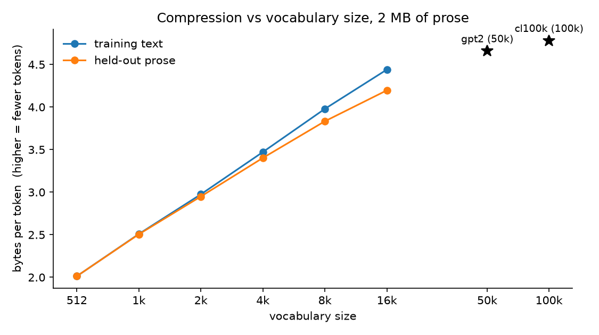

# tokenizer


A byte-level BPE tokenizer built from scratch — trainer, encoder, decoder — and one experiment on what vocabulary size actually buys.

Fourth in the series **[micrograd](https://github.com/diego-magana/micrograd) → [makemore](https://github.com/diego-magana/makemore) → [gpt](https://github.com/diego-magana/gpt) → tokenizer**. gpt tokenized Tiny Shakespeare one character at a time; this is the tokenizer a real GPT uses.

If you want the short version, read [`notebooks/02_vocab_size.ipynb`](notebooks/02_vocab_size.ipynb): the question, the prediction, the figure.

## What I found

A model is billed, bounded, and slowed per token, so bytes per token is a price, and vocabulary size is the one dial a tokenizer has for it. One tokenizer, trained once on 2 MB of prose to a 16k vocabulary, measured at every size from 512 up — merges are learned in order, so the first *k* merges of a 16k run *are* the tokenizer trained to *k* — on the training text and on held-out prose, with GPT-2 and cl100k on the same held-out text as reference points.

| vocab | train | held-out | gap | bytes per 1,024-token window |
|---|---|---|---|---|
| 512 | 2.01 | 2.01 | 0.0% | 2,061 |
| 1,024 | 2.51 | 2.51 | 0.1% | 2,566 |
| 2,048 | 2.97 | 2.95 | 0.9% | 3,020 |
| 4,096 | 3.47 | 3.40 | 2.0% | 3,484 |
| 8,192 | 3.98 | 3.83 | 3.8% | 3,925 |
| 16,384 | 4.44 | 4.20 | 5.8% | 4,297 |
| gpt2 (50,257) | — | 4.66 | — | 4,769 |
| cl100k (100,277) | — | 4.78 | — | 4,894 |

[](notebooks/02_vocab_size.ipynb)

**Each doubling buys less than the last, and a vocabulary overfits.** The first doubling buys +24% on held-out prose, the last +9%. The train/held-out gap opens from 0.0% at 512 to 5.8% at 16k: past a few thousand merges the tokenizer is spending entries on pairs frequent in its 2 MB and nowhere else. That is why production tokenizers train on gigabytes — and why GPT-2's 50k lands only 11% above this run's 16k on prose it never saw, and cl100k only 2.6% above GPT-2 with twice the vocabulary again.

**What this doesn't show.** Bytes per token is compression, not quality — whether a larger vocabulary helps a model predict is a training experiment. The references were trained on other corpora, so they show where production tokenizers land on this text, not what this trainer would reach at their size.

## What it builds

Text becomes UTF-8 bytes, so the starting vocabulary is 256 tokens and every string is representable. Training is a counting loop — find the most frequent adjacent pair, replace it everywhere with a new id, repeat — and encoding replays those merges in the order they were learned. `BasicTokenizer` is that algorithm exactly as the lecture builds it; `RegexTokenizer` adds GPT-2's regex pre-split, so merges never cross a word boundary. [`notebooks/01_bpe_walkthrough.ipynb`](notebooks/01_bpe_walkthrough.ipynb) derives all of it from one paragraph of text and ends by checking that the package learns byte-for-byte the same merges.

## Run it

```bash
pip install -e .                    # the package needs only `regex`
pip install -r requirements.txt     # tests + notebooks
pytest                              # 26 invariants
jupyter notebook notebooks/02_vocab_size.ipynb
```

The corpus and the trained tokenizer are committed, so the notebook reproduces the figure from `assets/prose_16k.model` in under a minute. Deleting that file retrains it (10–15 minutes); `scripts/fetch_prose.py` refetches the corpus.

```python
from tokenizer import RegexTokenizer

tok = RegexTokenizer()
tok.load("assets/prose_16k.model")
ids = tok.encode("Unicode! 🅤🅝🅘🅒🅞🅓🅔‽")
assert tok.decode(ids) == "Unicode! 🅤🅝🅘🅒🅞🅓🅔‽"
tok.truncated(4096)                 # the same tokenizer at a 4k vocabulary
```

## Repository layout

```
tokenizer/
├── tokenizer/
│   ├── base.py         get_stats, merge, the Tokenizer base class, save/load, truncated
│   ├── basic.py        BasicTokenizer — the lecture's algorithm as a class
│   └── regex.py        RegexTokenizer — GPT-2's pre-split, weighted training
├── notebooks/
│   ├── 01_bpe_walkthrough.ipynb   the lecture, cell by cell, ending at the package
│   └── 02_vocab_size.ipynb        the experiment
├── assets/             prose_16k.model (loadable) + prose_16k.vocab (readable) · vocab_size.png
├── data/               the walkthrough's text · prose_train.txt (2 MB) · prose_heldout.txt (1 MB)
├── scripts/            download_gpt2.py · fetch_prose.py
└── tests/              test_basic.py · test_regex.py
```

## Implementation notes

**Encode applies merges in learned order, not frequency order.** The most frequent pair in the *input* is irrelevant; the earliest-learned pair *present* wins, one merge at a time. Any other rule can produce a token sequence the model was never trained on. `test_basic.py` pins this with a case where the orders disagree; `test_regex.py` checks that encoding the training text lands on exactly the ids training ended with.

**Training counts over distinct chunks, weighted by frequency.** Two megabytes is ~400k regex chunks but only ~40k distinct ones; counting each once with its multiplicity gives the same statistics for a tenth of the work. Ties break on the pair itself, so the result depends only on the corpus — which is what makes a 16k run truncate to exactly the 4k run, and what `test_regex.py` verifies against a plain unweighted count.

## Attribution

The algorithm, the walkthrough, and the split pattern follow Andrej Karpathy's [*Let's build the GPT Tokenizer*](https://www.youtube.com/watch?v=zduSFxRajkE); the class layout follows his [minbpe](https://github.com/karpathy/minbpe). What I added: the tests, save/load in the shape of GPT-2's `vocab.bpe`, `truncated`, and the vocabulary-size experiment with its prediction and held-out measurement.
